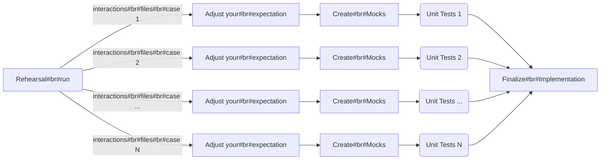
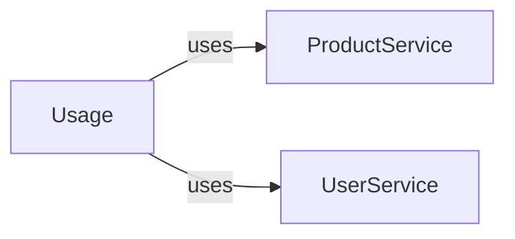

# Quick Start
- You can use Rehearser to help you build reliable unit tests quickly

## Development Flows:


## Steps
### **1. Installation**:
```bash
pip install rehearser
```

### **2. Creating a Rehearser Proxy**: 
- Class to be tested : `Usage`
- `Usage` uses `ProductService` and `UserService`



- In this step, we create Rehearser Proxies for instances `ProductService()` and `UserService()`, respectively.
```python
from rehearser import RehearserProxy
from examples.example1.usage import ProductService, UserService

rp_product = RehearserProxy(ProductService())
rp_user = RehearserProxy(UserService())
```

### **3. Generate Interactions**: 
Generate mock objects using the interactions created in the previous step.
```python
# Apply patches to UserService and ProductService
with patch(
    "rehearser.examples.example1.usage.UserService",
    return_value=rp_user,
), patch(
    "rehearser.examples.example1.usage.ProductService",
    return_value=rp_product,
):
    # Rehearsal run
    Usage().run_example()

    # Generate interactions files
    rp_user.set_interactions_file_directory("./raw_files/rehearser_proxy/")
    rp_user.write_interactions_to_file()

    rp_product.set_interactions_file_directory("./raw_files/rehearser_proxy/")
    rp_product.write_interactions_to_file()

```

### **4. Write Unit Test**:
Run your unit test with patched mocks now.
```python
# Instantiate mock objects
mock_users = MockGenerator(
    interactions_src="./raw_files/rehearser_proxy/UserService/latest_interactions.json"
).create_mock()
mock_products = MockGenerator(
    interactions_src="./raw_files/rehearser_proxy/ProductService/latest_interactions.json"
).create_mock()

# Apply patches to UserService and ProductService
with patch(
    "rehearser.examples.example1.usage.UserService",
    return_value=mock_users,
), patch(
    "rehearser.examples.example1.usage.ProductService",
    return_value=mock_products,
):
    # Instantiate Usage with the mocked services
    result = Usage().run_example()

    # Insert your test assertions here
    self.assertTrue(result, "run_example() failed")
```