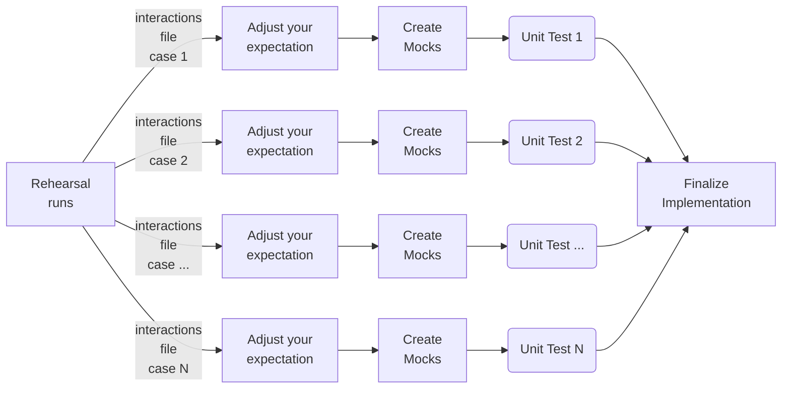

# Quick Start
You can use `Rehearser` to build reliable unit tests quickly

----
### Tutorials:
  - [Introduction](https://medium.com/@kevinchwong/unveiling-rehearser-revolutionize-your-python-unit-tests-d53eaa809d23)
  - [Step-by-step](https://medium.com/@kevinchwong/unlock-the-secrets-of-efficient-python-testing-with-rehearser-2b967f16c706)
----

### Development Flow:


---

### **Install Rehearser**:
```bash
pip install rehearser
```
---
### **Example 1: Mock a method:**
```python
from unittest.mock import Mock, patch

from rehearser.mock_generator import MockGenerator
from rehearser.rehearser_method import RehearserMethod


def long_run_method(x):
    print(f"Take a long time to run in {x*x} days...")
    return x*x


# Run a Rehearsal
rehearser = RehearserMethod(long_run_method)
with patch("__main__.long_run_method", rehearser.get_proxy_method()):
    a=long_run_method(1)
    b=long_run_method(2)
    c=long_run_method(3)
    
    # Your logic
    res = a + b + c
    print(res)


# Prepare interactions files
rehearser.interactions_file_directory="./rehearser_examples/examples/example1/tests/raw_files/"
rehearser.write_interactions_to_file()


# Unit test
mock = MockGenerator(
    interactions_src="./rehearser_examples/examples/example1/tests/raw_files/long_run_method/latest_interactions.json"
).create_mock()
with patch("__main__.long_run_method", mock):
    # Replay the long time running method output with the mocked method
    a=long_run_method(1)
    b=long_run_method(2)
    c=long_run_method(3)
    
    # Your logic to be tested:
    result = a + b + c

    print(f"Result from mockers: {result} where mocked a={a}, mocked b={b}, and mocked c={c}")
    # Verify the result
    assert res == 14
```

---

### **Example 2: Mock an instance**:

```python
from unittest.mock import Mock, patch

from rehearser.mock_generator import MockGenerator
from rehearser.rehearser_proxy import RehearserProxy


class ExternalService:
    def __init__(self):
        pass

    def long_run_method(self, x):
        print(f"Take a long time to run in {x*x} days...")
        return x * x


# Run a Rehearsal
rehearser = RehearserProxy(ExternalService())
with patch("__main__.ExternalService", return_value=rehearser):
    service = ExternalService()
    a = service.long_run_method(1)
    b = service.long_run_method(2)
    c = service.long_run_method(3)

    # Your logic
    res = a + b + c
    print(res)


# Prepare interactions files
rehearser.interactions_file_directory="./rehearser_examples/examples/example2/tests/raw_files/"
rehearser.write_interactions_to_file()


# Unit test
mock = MockGenerator(
    interactions_src="./rehearser_examples/examples/example2/tests/raw_files/ExternalService/latest_interactions.json"
).create_mock()
with patch("__main__.ExternalService", return_value=mock):
    # Replay the external service output with the mocked object
    service = ExternalService()
    a = service.long_run_method(1)
    b = service.long_run_method(2)
    c = service.long_run_method(3)

    # Your logic to be tested:
    result = a + b + c

    print(
        f"Result from mockers: {result} where mocked a={a}, mocked b={b}, and mocked c={c}"
    )
    # Verify the result
    assert res == 14


```
